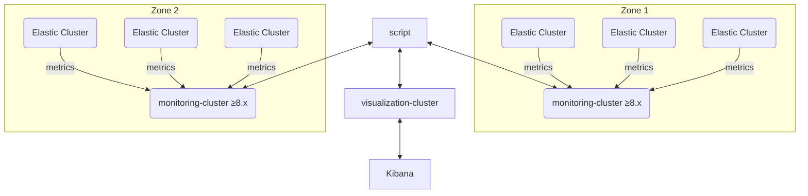

# Consumption Framework

A set of tools to help Elasticsearch users understand the consumption patterns of their deployments — resource allocation, ingest patterns, cost attribution, and growth planning — surfaced through Kibana dashboards.

**Supported Elasticsearch versions:** 7.x (internal monitoring), 8.x and 9.x (metricbeat)

---

## Table of Contents

- [What it does](#what-it-does)
- [How it works](#how-it-works)
- [Prerequisites](#prerequisites)
- [Quick Start](#quick-start)
  - [Option A: Python (local)](#option-a-python-local)
  - [Option B: Docker (recommended for ops / no-Python environments)](#option-b-docker)
- [Configuration](#configuration)
  - [Config file reference](#config-file-reference)
  - [Elasticsearch version compatibility](#elasticsearch-version-compatibility)
- [Commands reference](#commands-reference)
- [Permissions](#permissions)
- [Kibana dashboards](#kibana-dashboards)
- [Troubleshooting](#troubleshooting)

---

## What it does

With the data collected and the included Kibana dashboards you can:

- Understand ingest patterns and cost allocation across your entire organization.
- Explore billing data in ways not available out-of-the-box in the Elastic Cloud console.
- See how much data is being indexed and how storage is used per datastream and tier.

<details>
<summary>Dashboard screenshots</summary>


</details>

---

## How it works



1. Your Elasticsearch clusters ship metrics to a centralized [monitoring cluster](https://www.elastic.co/guide/en/cloud/current/ec-enable-logging-and-monitoring.html) via built-in monitoring collectors.
2. The framework reads those native `.monitoring-es-*` indices, enriches index-level data with node/tier context, aggregates it per datastream + tier, and writes results to a destination cluster.
3. Kibana dashboards visualize everything.

### Billing data

Hits the [ESS billing API](https://www.elastic.co/guide/en/cloud/current/Billing_Costs_Analysis.html) and indexes results into the destination cluster for the organization overview dashboard. Already-processed time windows are skipped automatically.

### Monitoring data

Processes monitoring data across 10-minute chunks and enriches index-level metrics with tier/node context. Cost is ventilated to each datastream across three dimensions: storage size, query time, and indexing time.

---

## Prerequisites

| Requirement | Notes |
|---|---|
| Elasticsearch cluster(s) | 8.x or 9.x — source (monitoring) and destination can be the same cluster |
| Stack monitoring enabled | Internal collection must be active on source clusters |
| API keys | See [Permissions](#permissions) |
| Python 3.11+ **or** Docker | For running the framework |
| AWS credentials (optional) | For fetching real costs from AWS Cost Explorer |

---

## Quick Start

### Step 1 — Create your config file

Copy the sample and fill in your values:

```bash
cp config.yml.sample config.yml
```

Minimal config (Elastic Cloud / ESS):

```yaml
organization_name: "My Org"
organization_id: "12345"          # from cloud.elastic.co → Account → Organization ID
billing_api_key: "essu_XXXX"      # needs billing-admin permissions

monitoring_source:
  cloud_id: 'deployment-name:BASE64STRING'
  api_key: 'SOURCE_API_KEY'
  retry_on_timeout: true
  request_timeout: 60

consumption_destination:
  cloud_id: 'deployment-name:BASE64STRING'
  api_key: 'DESTINATION_API_KEY'
```

Minimal config (on-premises / self-managed AWS):

```yaml
organization_name: "My Org"

monitoring_source:
  hosts: 'https://monitoring-cluster:9200'
  api_key: 'SOURCE_API_KEY'
  verify_certs: true
  retry_on_timeout: true
  request_timeout: 60

consumption_destination:
  hosts: 'https://destination-cluster:9200'
  api_key: 'DESTINATION_API_KEY'

# If monitoring uses V7 internal collection + V8 metricbeat together:
monitoring_index_pattern: '.monitoring*'

# Option 1: Fetch real costs from AWS (includes RI/savings plan discounts)
aws_cost_explorer:
  aws_access_key_id: 'AKIAXXXXXXXX'
  aws_secret_access_key: 'XXXXXXXX'
  region: 'us-east-1'
  tag_key: 'Application Name'
  tag_values:
    - 'ELMS - Enterprise Logging and Monitoring System'
    - 'elms'
  min_daily_cost: 500
  fallback_daily_cost: 887

# Option 2: Static cost per GB RAM/hour per tier
# on_prem_costs:
#   hot: 1.0
#   warm: 0.5
#   cold: 0.25
#   frozen: 0.1
```

---

### Option A: Python (local)

```bash
# 1. Install dependencies (Python 3.11+ required)
pip install -r requirements.txt

# 2. Initialize the destination cluster (run once)
python main.py init --config-file config.yml

# 3. Fetch billing data (ESS only)
python main.py get-billing-data --config-file config.yml --lookbehind 24

# 4. Consume monitoring data
python main.py consume-monitoring --config-file config.yml --lookbehind 24
```

Useful flags:

| Flag | Description |
|---|---|
| `--lookbehind N` | Hours of history to process (default: 24) |
| `--threads N` | Parallel worker threads (default: 5) |
| `--force` | Reprocess data even if it already exists |
| `--debug` | Verbose logging |
| `--compute-usages` | Also compute per-age-bucket datastream usage (produces more documents) |

---

### Option B: Docker

The Docker image is the recommended way to run the framework in production or hand it off to someone else — no Python environment needed.

#### Build the image

```bash
docker build -t consumption-framework:latest .

# Or using make:
make build
```

#### Run with a config file (simplest)

Mount your `config.yml` as a volume and pass the command as an argument:

```bash
# Initialize (run once)
docker run --rm \
  -v "$(pwd)/config.yml:/config.yml" \
  consumption-framework:latest \
  init --config-file /config.yml

# Fetch billing data
docker run --rm \
  -v "$(pwd)/config.yml:/config.yml" \
  consumption-framework:latest \
  get-billing-data --config-file /config.yml --lookbehind 24

# Consume monitoring data
docker run --rm \
  -v "$(pwd)/config.yml:/config.yml" \
  consumption-framework:latest \
  consume-monitoring --config-file /config.yml --lookbehind 24
```

#### Run with environment variables (no config file needed)

The entrypoint translates `CF_` environment variables into CLI flags, and `CFCONF_` variables into `--config key=value` pairs.

**`CF_` → CLI flag mapping:**
`CF_LOOKBEHIND=48` becomes `--lookbehind 48`
`CF_THREADS=10` becomes `--threads 10`
`CF_CONFIG_FILE=/config.yml` becomes `--config-file /config.yml`

**`CFCONF_` → `--config` mapping:**
`CFCONF_ORGANIZATION__NAME=MyOrg` becomes `--config organization_name=MyOrg`
`CFCONF_MONITORING__SOURCE__API__KEY=abc` becomes `--config monitoring_source.api_key=abc`

Example — all configuration via environment variables:

```bash
docker run --rm \
  -e CF_CONFIG_FILE=/config.yml \
  -v "$(pwd)/config.yml:/config.yml" \
  -e CF_LOOKBEHIND=48 \
  -e CF_THREADS=10 \
  consumption-framework:latest \
  consume-monitoring
```

Or fully inline without a config file:

```bash
docker run --rm \
  -e CFCONF_ORGANIZATION__NAME="My Org" \
  -e CFCONF_ORGANIZATION__ID="12345" \
  -e CFCONF_BILLING__API__KEY="essu_XXXX" \
  -e CFCONF_MONITORING__SOURCE__CLOUD__ID="name:BASE64" \
  -e CFCONF_MONITORING__SOURCE__API__KEY="src_key" \
  -e CFCONF_CONSUMPTION__DESTINATION__CLOUD__ID="name:BASE64" \
  -e CFCONF_CONSUMPTION__DESTINATION__API__KEY="dst_key" \
  consumption-framework:latest \
  consume-monitoring
```

#### Run as a scheduled container (cron-style)

To run on a schedule (e.g., every 12 hours), use Docker's `--restart always` with a wrapper or a cron container. The simplest approach with plain Docker:

```bash
# Run in daemon mode, restarting every 12 hours via an external cron or scheduler
docker run -d \
  --name consumption-framework \
  --restart always \
  -v "$(pwd)/config.yml:/config.yml" \
  consumption-framework:latest \
  consume-monitoring --config-file /config.yml --lookbehind 24
```

Or trigger it from the host crontab (`crontab -e`):

```cron
# Every day at 6 AM and 6 PM
0 6,18 * * * docker run --rm -v /path/to/config.yml:/config.yml consumption-framework:latest consume-monitoring --config-file /config.yml --lookbehind 13
```

#### Docker Compose example

Create a `docker-compose.yml` alongside your `config.yml`:

```yaml
version: "3.8"

services:
  consumption-init:
    image: consumption-framework:latest
    build: .
    volumes:
      - ./config.yml:/config.yml
    command: init --config-file /config.yml
    restart: "no"

  consumption-monitoring:
    image: consumption-framework:latest
    build: .
    volumes:
      - ./config.yml:/config.yml
    command: consume-monitoring --config-file /config.yml --lookbehind 24
    restart: "no"

  consumption-billing:
    image: consumption-framework:latest
    build: .
    volumes:
      - ./config.yml:/config.yml
    command: get-billing-data --config-file /config.yml --lookbehind 24
    restart: "no"
```

```bash
# Initialize (once)
docker compose run --rm consumption-init

# Run monitoring collection
docker compose run --rm consumption-monitoring

# Run billing collection (ESS only)
docker compose run --rm consumption-billing
```

---

## Configuration

### Config file reference

| Key | Required | Description |
|---|---|---|
| `organization_name` | Yes | Display name — written to every document |
| `organization_id` | ESS only | Elastic Cloud organization ID |
| `billing_api_key` | ESS only | API key with billing-admin rights |
| `monitoring_source` | Yes | Elasticsearch client params for the monitoring cluster |
| `consumption_destination` | Yes | Elasticsearch client params for the destination cluster |
| `on_prem_costs` | On-prem only | Cost per GB RAM/hour per tier (mutually exclusive with `billing_api_key`) |
| `aws_cost_explorer` | No | Fetch real daily costs from AWS Cost Explorer (see config sample) |
| `monitoring_index_pattern` | No | Override default `.monitoring-es-8-*,.monitoring-es-9-*` (e.g., `.monitoring*` for mixed V7+V8) |
| `parsing_regex_str` | No | Custom regex for parsing datastream names from index names |
| `api_host` | No | Override ESS API endpoint (default: `api.elastic-cloud.com`) |

`monitoring_source` and `consumption_destination` accept any parameter supported by the [elasticsearch-py client](https://elasticsearch-py.readthedocs.io/en/latest/api/elasticsearch.html): `hosts`, `cloud_id`, `api_key`, `http_auth`, `verify_certs`, `request_timeout`, `retry_on_timeout`, etc.

### Elasticsearch version compatibility

The Python client version must match your Elasticsearch server major version:

| ES server | Python client to install |
|---|---|
| 8.x (including 8.17.x) | `pip install "elasticsearch>=8.3.3,<9"` (default in `requirements.txt`) |
| 9.x | Change `requirements.txt` line to `elasticsearch>=9.0.0,<10`, then `pip install -r requirements.txt` |

For Docker with ES 9.x, edit `requirements.txt` before building:

```bash
sed -i 's/elasticsearch>=8.3.3,<9/elasticsearch>=9.0.0,<10/' requirements.txt
docker build -t consumption-framework:latest .
```

The monitoring index pattern for ES 9.x clusters is already included in the default: `.monitoring-es-8-*,.monitoring-es-9-*`.

> **Note:** Stack monitoring must be enabled on source clusters. For ES 8.x use `xpack.monitoring.elasticsearch.collection.enabled: true`. For ES 9.x, configure monitoring via Elastic Agent or Metricbeat and ensure data lands in `.monitoring-es-9-*` indices.

---

## Commands reference

```
python main.py [GLOBAL OPTIONS] COMMAND [COMMAND OPTIONS]
```

### `init`

Creates required assets on the destination cluster (index template, ILM policy, ingest pipeline). **Run once** before first use, or after upgrading.

```bash
python main.py init --config-file config.yml
```

Requires `manage_ingest_pipelines`, `manage_ilm`, and `manage_index_templates` cluster privileges on the destination. Alternatively, upload files from `consumption/_meta/` manually via Kibana Dev Tools.

### `consume-monitoring`

Reads monitoring data from the source cluster and writes enriched consumption documents to the destination.

```bash
python main.py consume-monitoring --config-file config.yml \
  --lookbehind 24 \
  --threads 5 \
  [--force] \
  [--compute-usages] \
  [--debug]
```

### `diagnose`

Checks what monitoring data is available in both V7 and V8 formats. Run this first to verify connectivity and data availability.

```bash
python main.py diagnose --config-file config.yml
```

### `get-billing-data`

Fetches org-level billing data from the ESS API. ESS deployments only.

```bash
python main.py get-billing-data --config-file config.yml \
  --lookbehind 24 \
  [--force] \
  [--debug]
```

---

## Permissions

### Source cluster (`monitoring_source`)

The API key needs `read` access to monitoring indices:

<details>
<summary>Create source API key (Dev Tools)</summary>

```json
POST /_security/api_key
{
  "name": "consumption_framework_source",
  "role_descriptors": {
    "consumption_framework": {
      "indices": [
        {
          "names": [".monitoring-es-7-*", ".monitoring-es-8-*", ".monitoring-es-9-*"],
          "privileges": ["read"]
        }
      ]
    }
  }
}
```

</details>

### AWS Cost Explorer (optional)

If using `aws_cost_explorer` config, the AWS IAM user/role needs:

```json
{
  "Effect": "Allow",
  "Action": ["ce:GetCostAndUsage", "ec2:DescribeInstances"],
  "Resource": "*"
}
```

### Destination cluster (`consumption_destination`)

The API key needs `read`, `index`, `view_index_metadata`, and `auto_configure` on `consumption*`. If running `init`, also needs cluster-level privileges:

<details>
<summary>Create destination API key (Dev Tools)</summary>

```json
POST /_security/api_key
{
  "name": "consumption_framework_destination",
  "role_descriptors": {
    "consumption_framework": {
      "cluster": [
        "manage_ingest_pipelines",
        "manage_ilm",
        "manage_index_templates"
      ],
      "indices": [
        {
          "names": ["consumption*"],
          "privileges": [
            "read",
            "view_index_metadata",
            "index",
            "auto_configure"
          ]
        }
      ]
    }
  }
}
```

</details>

Once `init` has been run successfully, the cluster privileges can be removed from the key and you can use a more restricted key for ongoing data collection.

---

## Kibana dashboards

Import the dashboards from the `kibana_exports/` directory:

1. Open Kibana → **Stack Management → Saved Objects**
2. Click **Import** and select the `.ndjson` files from `kibana_exports/`
3. Set the index pattern to `consumption*`

---

## Troubleshooting

### `UnsupportedProductError` or client refuses to connect

Your elasticsearch-py client version does not match your server. See [Elasticsearch version compatibility](#elasticsearch-version-compatibility).

### `KeyError: 'after_key'` in logs

Upgrade to the latest version of this framework — this was a pagination bug fixed for ES 8.17+.

### No data in dashboards after running

1. Run `python main.py diagnose --config-file config.yml` to verify data availability.
2. Confirm `init` was run on the destination cluster.
3. Check that monitoring indices (`.monitoring-es-7-*` or `.monitoring-es-8-*`) exist on the source cluster.
4. Run with `--debug` to see detailed query logs.
5. Verify API key permissions on both clusters.

### Script runs but produces 0 documents

- Run `diagnose` to check what monitoring data is available.
- If V7 data exists but V8 doesn't, ensure `monitoring_index_pattern` is set to `.monitoring*` or `.monitoring-es-7-*`.
- The source API key may lack `read` on `.monitoring-es-*`.
- Re-run with `--force` if data exists but was already processed.

### Costs show as 0

- If using `aws_cost_explorer`: check AWS credentials and IAM permissions.
- If using `on_prem_costs`: verify values are set in config.yml.
- Run with `--debug` and look for "AWS Cost Explorer" or "cost" log messages.

### SSL / certificate errors

Add `verify_certs: false` under `monitoring_source` or `consumption_destination` in your config (not recommended for production). Alternatively, supply `ca_certs: /path/to/ca.pem`.

### Running behind a proxy

Set `HTTP_PROXY` / `HTTPS_PROXY` environment variables — the framework picks them up automatically.

```bash
export HTTPS_PROXY=http://proxy.example.com:8080
python main.py consume-monitoring --config-file config.yml
```

For Docker:

```bash
docker run --rm \
  -e HTTPS_PROXY=http://proxy.example.com:8080 \
  -v "$(pwd)/config.yml:/config.yml" \
  consumption-framework:latest \
  consume-monitoring --config-file /config.yml
```
